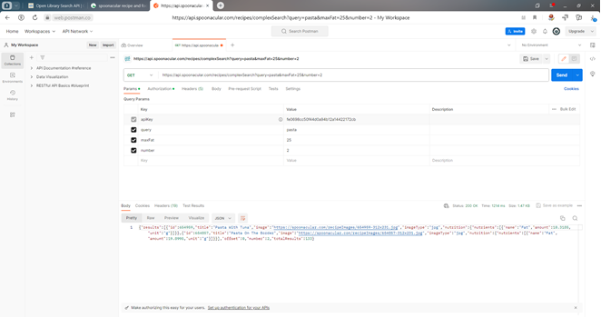
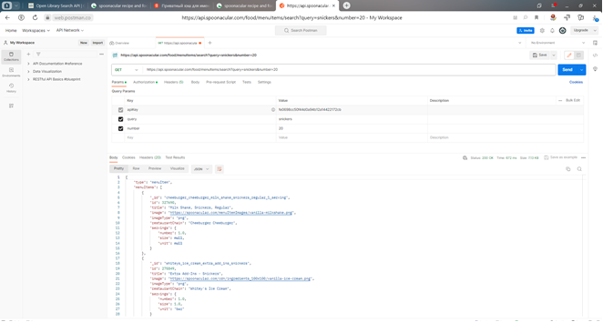

# Семинар 1
1.	Ознакомиться с некоторые интересными API. https://docs.ozon.ru/api/seller/, https://developers.google.com/youtube/v3/getting-started, https://spoonacular.com/food-api
2.	Потренируйтесь делать запросы к API. Выберите публичный API, который вас интересует, и потренируйтесь делать API-запросы с помощью Postman.
3.	Поэкспериментируйте с различными типами запросов и попробуйте получить различные типы данных.

Запрос количества жиров в блюде Паста

Рецепт молочный коктейль сникерс обычный 1 порция

4.	Сценарий Foursquare
5.	Напишите сценарий на языке Python, который предложит пользователю ввести интересующую его категорию (например, кофейни, музеи, парки и т.д.).
6.	Используйте API Foursquare для поиска заведений в указанной категории.
7.	Получите название заведения, его адрес и рейтинг для каждого из них.
8.	Скрипт должен вывести название и адрес и рейтинг каждого заведения в консоль. [code](hw_1.py)

# Семинар 2
1. Выполнить скрейпинг данных в веб-сайта http://books.toscrape.com/
и извлечь информацию о всех книгах на сайте во всех категориях: 
название, цену, количество товара в наличии (In stock (19 available)) в формате integer, описание [code](hw_2.py).
Затем сохранить эту информацию в JSON-файле [code](books_data.json).
### PS: Скрапинг количества книг по непонятной мне причине производится с главной страницы сайта, а не со страницы с описанием книги,
поэтому выполнение программы при указании индекса 2 выдает ошибку index out of range. 
Пришлось добавить лишние строки кода и проверки, что очень сильно увеличило время скрапинга

# Семинар 3
1. Установите MongoDB на локальной машине, а также зарегистрируйтесь в онлайн-сервисе. https://www.mongodb.com/ https://www.mongodb.com/products/compass
2. Загрузите данные который вы получили на предыдущем уроке путем скрейпинга сайта с помощью Buautiful Soup в MongoDB и создайте базу данных и коллекции для их хранения [code](hw_3.py).
3. Поэкспериментируйте с различными методами запросов [code](001.png).

# Семинар 4
Код [code](hw_4.py) и данные [file](countries_and_capitals.csv)
1. Выберите веб-сайт с табличными данными, который вас интересует.
2. Напишите код Python, использующий библиотеку requests для отправки HTTP GET-запроса на сайт и получения HTML-содержимого страницы.
3. Выполните парсинг содержимого HTML с помощью библиотеки lxml, чтобы извлечь данные из таблицы.
4. Сохраните извлеченные данные в CSV-файл с помощью модуля csv.

Ваш код должен включать следующее:

Строку агента пользователя в заголовке HTTP-запроса, чтобы имитировать веб-браузер и избежать блокировки сервером.
Выражения XPath для выбора элементов данных таблицы и извлечения их содержимого.
Обработка ошибок для случаев, когда данные не имеют ожидаемого формата.
Комментарии для объяснения цели и логики кода.

Примечание: Пожалуйста, не забывайте соблюдать этические и юридические нормы при веб-скреппинге.